<!-- Animated header banner (assets/header.svg) -->

<!-- Typing animation -->

## 🙋‍♂️ About Me

- 🔭 I'm currently working on personal projects and leveling up my skills
- 🌱 Always learning something new, one commit at a time
- 📫 How to reach me: [ren910223@gmail.com](mailto:ren910223@gmail.com)

<!-- ✏️ 上面這段可以自由改成你想介紹的內容 -->

## 🛠 Tech Stack

<!-- ✏️ 把不符合的技能刪掉、加上你常用的技術。徽章產生器:https://shields.io -->

  
  
  
  
  
  

## 📊 GitHub Stats

  
  

  

## 🐍 Contribution Snake

  <picture>
    <source media="(prefers-color-scheme: dark)" srcset="https://raw.githubusercontent.com/rennn0223/rennn0223/output/github-snake-dark.svg" />
    <source media="(prefers-color-scheme: light)" srcset="https://raw.githubusercontent.com/rennn0223/rennn0223/output/github-snake.svg" />
    
  </picture>

---

  ⚡ This README is powered by an animated SVG banner, <a href="https://github.com/DenverCoder1/readme-typing-svg">readme-typing-svg</a>, <a href="https://github.com/anuraghazra/github-readme-stats">github-readme-stats</a>, and <a href="https://github.com/Platane/snk">snk</a> — regenerated daily by GitHub Actions.

