<h3><code>ren@github ~ $ ./contributions.sh</code></h3>

  

<h3><code>ren@github ~ $ whoami</code></h3>
<table>
  <tr>
    <td valign="top"></td>
    <td valign="top"></td>
  </tr>
</table>

<!--
Everything above is self-generated animated SVG — no third-party stats
services, no tokens, no JavaScript. See scripts/ for the pipeline:

  prep_photo.py + make_ascii_svg.py  -> ren-ascii.svg       (rerun when the photo changes)
  make_info_card.py                  -> info-card.svg       (rerun when your details change)
  fetch_contributions.py + render_heatmap_svg.py -> contrib-heatmap.svg
                                        (refreshed daily by .github/workflows/update-profile-art.yml)
-->
